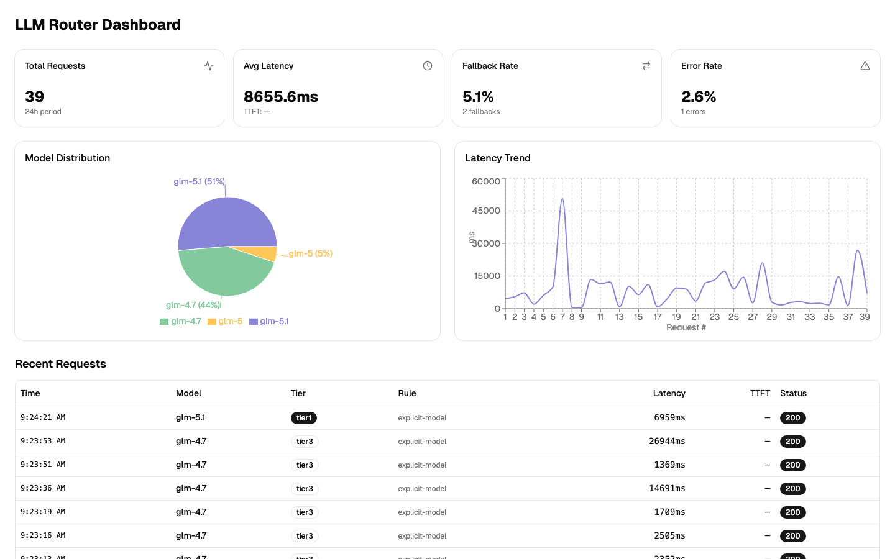

# LLM Router

A lightweight multi-model routing proxy with intelligent request classification, automatic failover, and a real-time monitoring dashboard. Compatible with the Anthropic Messages API.

## Features

- **Feature-based tier scoring** — classify requests by context size, code/error signals, task intent, and legacy rule bonuses, then map the request to the right tier
- **ML-assisted routing** — optional bert-tiny-llm-router model for semantic request complexity prediction (<10ms CPU inference)
- **Automatic fallback** — same-tier and cross-tier degradation with configurable cooldown and error thresholds
- **Streaming support** — full SSE passthrough with Time-To-First-Token (TTFT) tracking
- **Zero-overhead logging** — async queue with background batch flush to daily JSONL files; no impact on request latency
- **Real-time dashboard** — latency trends, model distribution, and request details with 10-second auto-refresh
- **Hot reload** — update `config.yaml` and reload without restart (`POST /reload` or `kill -HUP`)

## Architecture

```
Client (Claude Code / curl / SDK)
        │
        ▼
┌───────────────────┐
│   FastAPI Proxy   │  POST /v1/messages
│                   │
│  Router ──────────┤  Feature scoring → tier selection
│  LatencyTracker ──┤  Sliding window health tracking
│  RequestLogger ───┤  Async queue → JSONL
│  StreamProxy ─────┤  SSE forwarding + fallback
└───────┬───────────┘
        │
        ▼
  Upstream LLM APIs (Anthropic-compatible)
```

## Quick Start

### Install

```bash
pip install -r requirements.txt
```

### Configure

Create `config.yaml` (see [Configuration](#configuration) for full reference):

```yaml
providers:
  glm:
    base_url: "https://open.bigmodel.cn/api/anthropic"
    api_key: "${API_KEY}"
    api_format: "anthropic"
    timeout: 120

models:
  tier1:
    - id: "glm-5.1"
      provider: glm
  tier2:
    - id: "glm-5"
      provider: glm
  tier3:
    - id: "glm-4.7"
      provider: glm

rules:
  - name: "explicit-model"
    match: "model_is_known"
    action: "passthrough"
  - name: "complex-request"
    match: "estimated_tokens > 4000 or message_count > 20"
    target: tier1
  - name: "keyword-match"
    keywords: ["refactor", "design", "debug"]
    target: tier1
  - name: "default"
    target: tier3

scoring:
  enabled: true
  tiers:
    tier1:
      threshold: 6.0
    tier2:
      threshold: 3.0

fallback:
  latency_threshold_ms: 30000
  error_threshold: 3
  cooldown_seconds: 120
  cross_tier: true
  degradation_order: [tier1, tier2, tier3]

server:
  host: "127.0.0.1"
  port: 8000
```

### Run

```bash
python -m llm_router config.yaml
```

The proxy listens at `http://127.0.0.1:8000` by default. Point your Anthropic SDK or tool at this address.

### Dashboard

```bash
cd dashboard
npm install
npm run build   # output → dashboard/dist/
```

The built dashboard is served automatically at the root path (`/`) by the FastAPI server.

For development:

```bash
cd dashboard
npm run dev     # dev server on :5173 with /api proxy → localhost:8000
```

## Configuration

### Providers

Each provider defines an upstream API endpoint:

| Field | Description |
|-------|-------------|
| `base_url` | Upstream API base URL |
| `api_key` | API key. Supports `${ENV_VAR}` expansion |
| `api_format` | `anthropic` (only format currently supported) |
| `timeout` | Request timeout in seconds |

### Models

Models are organized into tiers. Tier naming is arbitrary — use whatever makes sense for your use case. Each model entry maps to a provider:

```yaml
models:
  tier1:              # high-capability
    - id: "glm-5.1"
      provider: glm
  tier3:              # routine tasks
    - id: "glm-4.7"
      provider: glm
```

### Rules

Rules are still supported, but when scoring is enabled they act as bonus signals rather than the only decision source.

| Rule Type | Key | Description |
|-----------|-----|-------------|
| Explicit model | `match: "model_is_known"` | Passes through when the requested model ID matches a known model |
| Expression | `match: "<expr>"` | Legacy signal evaluated with `estimated_tokens` and `message_count` |
| Keyword | `keywords: [...]` | Legacy signal that boosts the target tier when a keyword matches |
| Default | `name: "default"` | Catch-all fallback when scoring is disabled |

### Scoring

Scoring extracts a structured feature snapshot from the request, then computes per-tier scores:

- Context size: `estimated_tokens`, `message_count`
- Code and debugging hints: code blocks, file paths, stack traces, error keywords
- Task intent: implementation, architecture, migration, performance, documentation
- Legacy rule bonus: existing rule matches can still boost a tier instead of hard-overriding everything

Use `scoring.tiers.<tier>.threshold` to control promotion into higher tiers, and `scoring.features.<feature>.weights` to tune how strongly each signal affects each tier.

### ML Routing

Optional ML-based complexity prediction using the bert-tiny-llm-router model:

```yaml
ml_routing:
  enabled: true                        # Enable ML routing
  model_name: "leftfield7/bert-tiny-llm-router"
  model_cache_dir: "./models/cache"
  inference:
    timeout_ms: 50                     # Max time to wait for prediction
    fallback_on_error: true            # Fall back to rules on error
  weights:
    tier1: 2.0                         # ML prediction weight coefficient
    tier2: 2.0
    tier3: 2.0
```

The model predicts request complexity (simple/medium/complex) and returns probability distributions that are weighted and combined with other scoring features. If ML prediction fails or times out, the router gracefully degrades to rule-based scoring.

### Fallback

When a model fails (error or high latency), the proxy attempts fallback:

```yaml
fallback:
  latency_threshold_ms: 30000   # mark unavailable above this
  error_threshold: 3            # consecutive errors before marking unavailable
  cooldown_seconds: 120         # retry window after marking unavailable
  cross_provider: true          # allow cross-provider fallback
  cross_tier: true              # allow cross-tier fallback
  degradation_order: [tier1, tier2, tier3]   # fallback direction
```

### Logging

```yaml
logging:
  enabled: true
  dir: "./logs"
  flush_interval_seconds: 2
  flush_batch_size: 50
  retention_days: 30
```

Logs are written to `logs/requests-YYYY-MM-DD.jsonl` with daily rotation. Each entry:

```json
{
  "request_id": "uuid",
  "timestamp": "2026-04-15T00:45:11+00:00",
  "requested_model": "auto",
  "selected_tier": "tier2",
  "estimated_tokens": 3500,
  "message_count": 12,
  "matched_rule": "scoring:generation",
  "matched_by": "scoring",
  "tier_scores": {"tier1": 1.0, "tier2": 5.0, "tier3": 0.0},
  "detected_features": ["medium_context", "generation_heavy"],
  "routed_model": "glm-5",
  "routed_tier": "tier2",
  "routed_provider": "glm",
  "is_fallback": false,
  "fallback_chain": [],
  "latency_ms": 4609,
  "ttft_ms": 320,
  "is_stream": true,
  "status": 200,
  "error": null
}
```

## API Reference

### Proxy

| Method | Path | Description |
|--------|------|-------------|
| `POST` | `/v1/messages` | Anthropic Messages API proxy |
| `GET` | `/v1/models` | List available models |

### Monitoring

| Method | Path | Description |
|--------|------|-------------|
| `GET` | `/health` | Health check (`{"status": "ok"}`) |
| `GET` | `/status` | Model availability, latency stats, error counts |
| `GET` | `/api/logs/recent?offset=0&limit=50` | Recent request log entries |
| `GET` | `/api/logs/stats?hours=24` | Aggregated statistics, tier distribution, and feature counts |
| `GET` | `/api/logs/replay?hours=24&limit=100` | Re-score logged feature snapshots with the current weights |

### Management

| Method | Path | Description |
|--------|------|-------------|
| `POST` | `/reload` | Hot-reload configuration from disk |

## Dashboard

The built-in dashboard provides real-time visibility into routing behavior:



- **Stats cards** — total requests, average latency, fallback rate, error rate
- **Latency chart** — per-request latency and TTFT trend lines
- **Model chart** — request distribution across models
- **Request table** — recent requests with routing details

The dashboard auto-refreshes every 10 seconds.

## Running as a Service (macOS)

Save a launchd plist to `~/Library/LaunchAgents/`:

```xml
<?xml version="1.0" encoding="UTF-8"?>
<!DOCTYPE plist PUBLIC "-//Apple//DTD PLIST 1.0//EN"
  "http://www.apple.com/DTDs/PropertyList-1.0.dtd">
<plist version="1.0">
<dict>
    <key>Label</key>
    <string>ai.wangwenfei.llm-router</string>
    <key>ProgramArguments</key>
    <array>
        <string>/usr/bin/env</string>
        <string>python</string>
        <string>-m</string>
        <string>llm_router</string>
        <string>/path/to/config.yaml</string>
    </array>
    <key>WorkingDirectory</key>
    <string>/path/to/llm-router</string>
    <key>RunAtLoad</key>
    <true/>
    <key>KeepAlive</key>
    <true/>
</dict>
</plist>
```

```bash
launchctl load ~/Library/LaunchAgents/ai.wangwenfei.llm-router.plist
```

## Project Structure

```
llm-router/
├── config.yaml                 # Router configuration
├── requirements.txt            # Python dependencies
├── run.sh                      # Launcher script
├── THIRD_PARTY_LICENSES.md     # Third-party component licenses
├── llm_router/
│   ├── __main__.py             # CLI entry point
│   ├── main.py                 # FastAPI app, routes, lifespan
│   ├── config.py               # YAML config loader
│   ├── router.py               # Rule evaluation, tier selection
│   ├── scoring.py              # Feature-based scoring engine
│   ├── model_loader.py         # ML model loader (bert-tiny-llm-router)
│   ├── proxy.py                # Streaming proxy with fallback
│   ├── latency.py              # Sliding-window latency tracker
│   ├── request_logger.py       # Async JSONL logger
│   └── schemas.py              # Pydantic models
├── dashboard/
│   ├── src/
│   │   ├── App.tsx             # Main layout
│   │   ├── components/         # Charts, table, cards
│   │   └── hooks/useApi.ts     # API client
│   ├── dist/                   # Built static files (served by FastAPI)
│   └── package.json
├── models/                     # ML model cache directory
├── logs/                       # JSONL log files
└── docs/
    └── dashboard.png           # Dashboard screenshot
```

## License

[MIT](LICENSE)

This project uses third-party components. See [THIRD_PARTY_LICENSES.md](THIRD_PARTY_LICENSES.md) for details.
